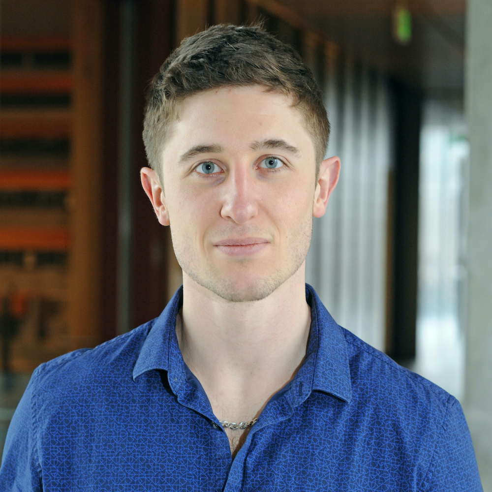

<link rel="stylesheet" href="styles.css" type="text/css">

I graduated from Shippensburg University of Pennsylvania with a MS in biology in 2017. After my masters, I began working toward my PhD in Immunology and Infectious Diseases at Washington State University. Following my rotations, I decided to join the laboratory of [Dr. Ilia Karatsoreos](https://www.karatsoreoslab.org/) and began investigating the role of the circadian (daily) clock in sickness behavior and viral encephalitis. Our lab has recently moved to the University of Massachusetts where I am currently a 4th year graduate student in the [Neuroscience and Behavior Program](https://gpls.cns.umass.edu/nsb). 

My full CV is available [here](files/pearson-cv-2020-05-12.pdf).
